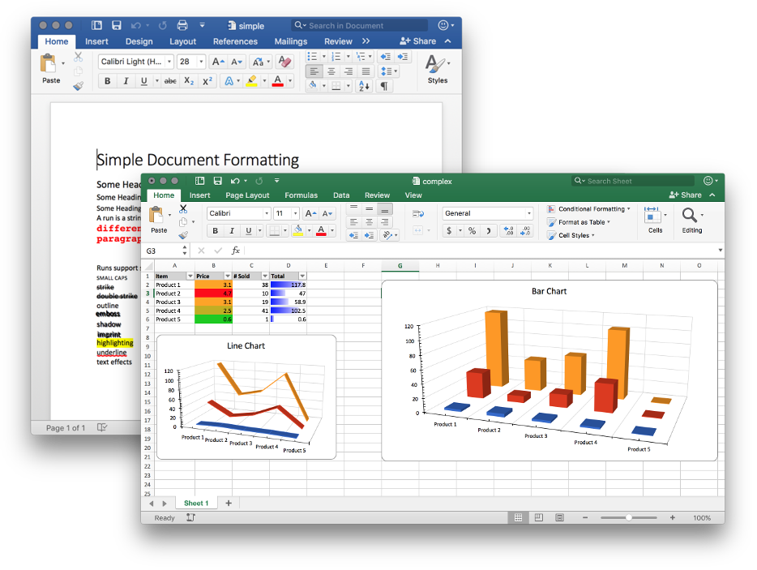

***Announcement (2019/04/29): UniDoc aquires gooxml.*** [UniDoc](https://unidoc.io) (https://unidoc.io and https://github.com/unidoc) has aquired gooxml from Baliance and we plan to add it to our suite of document format support for Go.

The repository (gooxml) will be moving to a new home: https://github.com/unidoc/unioffice and the package name will be come `unioffice`.

This will require updating import paths of existing code to `github.com/unidoc/unioffice`.  This move will take place in the weekend of the 5th of May.

*Update 2019/05/04: The move has been completed.*

----
----


**unioffice** is a library for creation of Office Open XML documents (.docx, .xlsx
and .pptx).  It's goal is to be the most compatible and highest performance Go
library for creation and editing of docx/xlsx/pptx files.

Requires **go1.8+**, builds are tested with 1.8, 1.9 and tip.

[](https://travis-ci.org/unidoc/unioffice)
[](https://github.com/unidoc/unioffice/releases)
[](https://www.gnu.org/licenses/agpl-3.0)
[](https://godoc.org/github.com/unidoc/unioffice)
[](http://golang.org)



## Status ##

- Documents (docx) [Word]
	- Read/Write/Edit
	- Formatting
	- Images
	- Tables
- Spreadsheets (xlsx) [Excel]
 	- Read/Write/Edit
 	- Cell formatting including conditional formatting
	- Cell validation (drop down combobox, rules, etc.)
    - Retrieve cell values as formatted by Excel (e.g. retrieve a date or number as displayed in Excel)
 	- Formula Evaluation (100+ functions supported currently, more will be added as required)
 	- Embedded Images
 	- All chart types
- PowerPoint (pptx) [PowerPoint]
	- Creation from templates
	- Textboxes/shapes


## Performance ##

There has been a great deal of interest in performance numbers for spreadsheet
creation/reading lately, so here are unioffice numbers for this
[benchmark](https://github.com/unidoc/unioffice/tree/master/_examples/spreadsheet/lots-of-rows)
which creates a sheet with 30k rows, each with 100 columns.

    creating 30000 rows * 100 cells took 3.92506863s
    saving took 89ns
    reading took 9.522383048s

Creation is fairly fast, saving is very quick due to no reflection usage, and
reading is a bit slower. The downside is that the binary is large (33MB) as it
contains generated structs, serialization and deserialization code for all of
DOCX/XLSX/PPTX.

## Installation ##
    
    go get github.com/unidoc/unioffice/
    go build -i github.com/unidoc/unioffice/...

## Document Examples ##

- [Simple Text Formatting](https://github.com/unidoc/unioffice/tree/master/_examples/document/simple) Text font colors, sizes, highlighting, etc.
- [Auto Generated Table of Contents](https://github.com/unidoc/unioffice/tree/master/_examples/document/toc) Creating document headings with an auto generated TOC based off of the headingds
- [Floating Image](https://github.com/unidoc/unioffice/tree/master/_examples/document/image) Placing an image somewhere on a page, absolutely positioned with different text wrapping.
- [Header & Footer](https://github.com/unidoc/unioffice/tree/master/_examples/document/header-footer) Creating headers and footers including page numbering.
- [Multiple Headers & Footers](https://github.com/unidoc/unioffice/tree/master/_examples/document/header-footer-multiple) Using different headers and footers depending on document section.
- [Inline Tables](https://github.com/unidoc/unioffice/tree/master/_examples/document/tables) Adding an table with and without borders.
- [Using Existing Word Document as a Template](https://github.com/unidoc/unioffice/tree/master/_examples/document/use-template) Opening a document as a template to re-use the styles created in the document.
- [Filling out Form Fields](https://github.com/unidoc/unioffice/tree/master/_examples/document/fill-out-form) Opening a document with embedded form fields, filling out the fields and saving the result as  a new filled form.
- [Editing an existing document](https://github.com/unidoc/unioffice/tree/master/_examples/document/edit-document) Open an existing document and replace/remove text without modifying formatting.

## Spreadsheet Examples ##
- [Simple](https://github.com/unidoc/unioffice/tree/master/_examples/spreadsheet/simple) A simple sheet with a few cells
- [Named Cells](https://github.com/unidoc/unioffice/tree/master/_examples/spreadsheet/named-cells) Different ways of referencing rows and cells
- [Cell Number/Date/Time Formats](https://github.com/unidoc/unioffice/tree/master/_examples/spreadsheet/number-date-time-formats) Creating cells with various number/date/time formats
- [Line Chart](https://github.com/unidoc/unioffice/tree/master/_examples/spreadsheet/line-chart)/[Line Chart 3D](https://github.com/unidoc/unioffice/tree/master/_examples/spreadsheet/line-chart-3d) Line Charts
- [Bar Chart](https://github.com/unidoc/unioffice/tree/master/_examples/spreadsheet/bar-chart) Bar Charts
- [Mutiple Charts](https://github.com/unidoc/unioffice/tree/master/_examples/spreadsheet/multiple-charts) Multiple charts on a single sheet
- [Named Cell Ranges](https://github.com/unidoc/unioffice/tree/master/_examples/spreadsheet/named-ranges) Naming cell ranges
- [Merged Cells](https://github.com/unidoc/unioffice/tree/master/_examples/spreadsheet/merged) Merge and unmerge cells
- [Conditional Formatting](https://github.com/unidoc/unioffice/tree/master/_examples/spreadsheet/conditional-formatting) Conditionally formatting cells, styling, gradients, icons, data bar
- [Complex](https://github.com/unidoc/unioffice/tree/master/_examples/spreadsheet/complex) Multiple charts, auto filtering and conditional formatting
- [Borders](https://github.com/unidoc/unioffice/tree/master/_examples/spreadsheet/borders) Individual cell borders and rectangular borders around a range of cells.
- [Validation](https://github.com/unidoc/unioffice/tree/master/_examples/spreadsheet/validation) Data validation including combo box dropdowns.
- [Frozen Rows/Cols](https://github.com/unidoc/unioffice/tree/master/_examples/spreadsheet/freeze-rows-cols) A sheet with a frozen header column and row

## Presentation Examples ##

- [Simple Text Boxes](https://github.com/unidoc/unioffice/tree/master/_examples/presentation/simple) Simple text boxes and shapes
- [Images](https://github.com/unidoc/unioffice/tree/master/_examples/presentation/image) Simple image insertion
- [Template](https://github.com/unidoc/unioffice/tree/master/_examples/presentation/use-template/simple) Creating a presentation from a template

## Raw Types ##

The OOXML specification is large and creating a friendly API to cover the entire
specification is a very time consuming endeavor.  This library attempts to
provide an easy to use API for common use cases in creating OOXML documents
while allowing users to fall back to raw document manipulation should the
library's API not cover a specific use case.

The raw XML based types reside in the ```schema/``` directory. These types are
accessible from the wrapper types via a ```X()``` method that returns the raw
type. 

For example, the library currently doesn't have an API for setting a document
background color. However it's easy to do manually via editing the
```CT_Background``` element of the document.

    dox := document.New()
    doc.X().Background = wordprocessingml.NewCT_Background()
	doc.X().Background.ColorAttr = &wordprocessingml.ST_HexColor{}
	doc.X().Background.ColorAttr.ST_HexColorRGB = color.RGB(50, 50, 50).AsRGBString()

### Contribution guidelines ###

[](https://cla-assistant.io/unidoc/unioffice)

All contributors are must sign a contributor license agreement before their code
will be reviewed and merged.


### Licensing ###

This library is offered under a dual license. It is freely available for use
under the terms of AGPLv3. If you would like to use this library for a closed
source project, please contact sales@unidoc.io.

There are no differences in functionality between the open source and commercial 
versions. You are encouraged to use the open source version to evaluate the library
before purchasing a commercial license.

